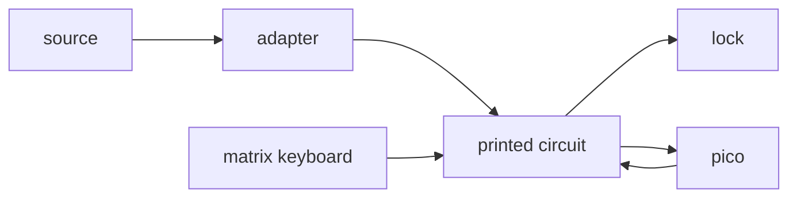

# drawer-lock-system
This drawer lock system is a raspberry pi pico project using a 12V electromagnetic lock. I can say that its strength is excellent after many testing and forcing, and the code which does the logic of the system is simple but effective.
## Elements
- 12V adapter
- 12V solenoid lock
- rasberry pi pico
- printed circuit
- 4x4 matrix keyboard
- keep plate
- lock support

## Operation
The adapter gives the circuit 12V which powers the pico with 5V and the lock with 12V. The pico starts to listen the keyboard, logs the keypresses and does the logic.

## Usage
The pin code must contain 4 digits. The default pin is 0000.
### Opening the lock
- Type in the pin code.
- Press "#" to open the lock.
### Changing the pin code
- Type in the pin code.
- Get admin access with "A".
- Type in the new pin code.
> **Remember that the pin code must be 4 digits long!**
- Press "B" to confirm it and to leave admin mode, or if you are unsure, you can always press the "*" button to reset your input.
> **If you want to leave admin mode without changing the code just press "D".**

> **After every change, like getting admin access or changing the code, the lock will open for 0.05 seconds to confirm it.**
## Pictures

